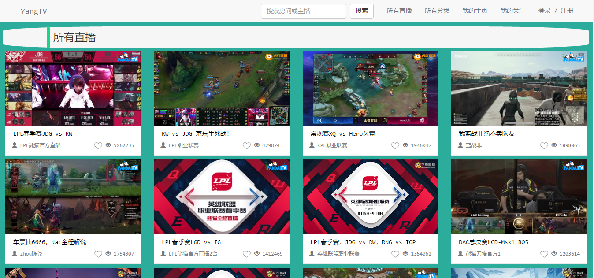
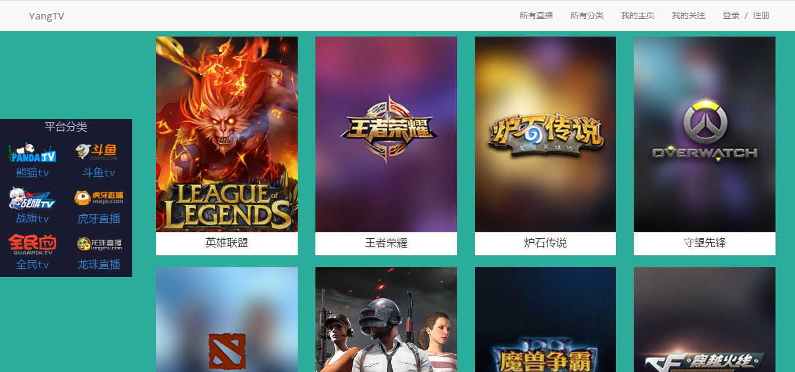
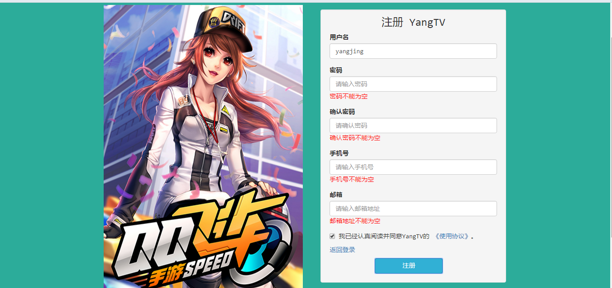
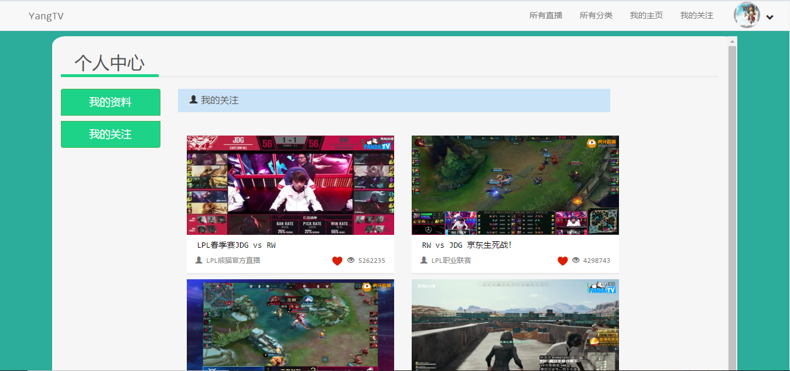
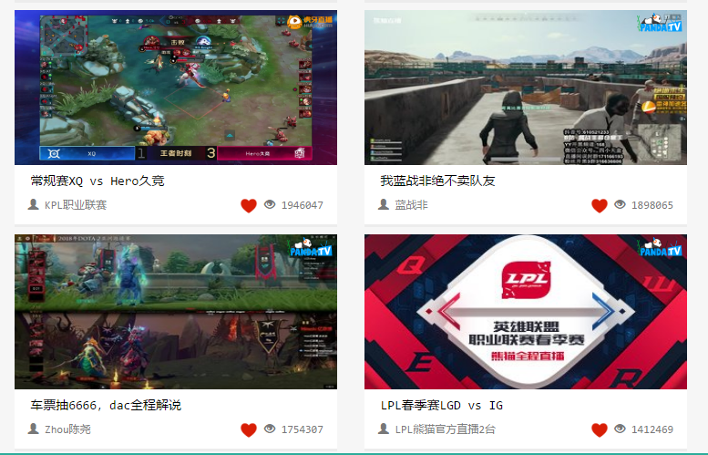
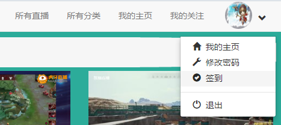

# LiveCollectionPlatform
[](https://996.icu) 
[](https://github.com/996icu/996.ICU/blob/master/LICENSE)

用Java编写的一个直播平台聚合网站，收集各大直播平台热门有趣的直播，享受直播的乐趣吧！

## 欢迎大家分享意见和代码。
## 最新版在dev分支，开发或贡献代码请加入dev分支。

## mysql数据库 配置
liveplatform数据库编码请使用 utf8mb4

my.ini
```
在文件最后一行加入
[mysqld]

max_allowed_packet=20M

```
## 图片介绍

### 所有直播



### 平台和分类



### 个人注册



### 我的关注




### 其他



## LICENSE

MIT Anti996

欢迎 Star 和 Fork ~

如果你有什么问题请提 Issue
